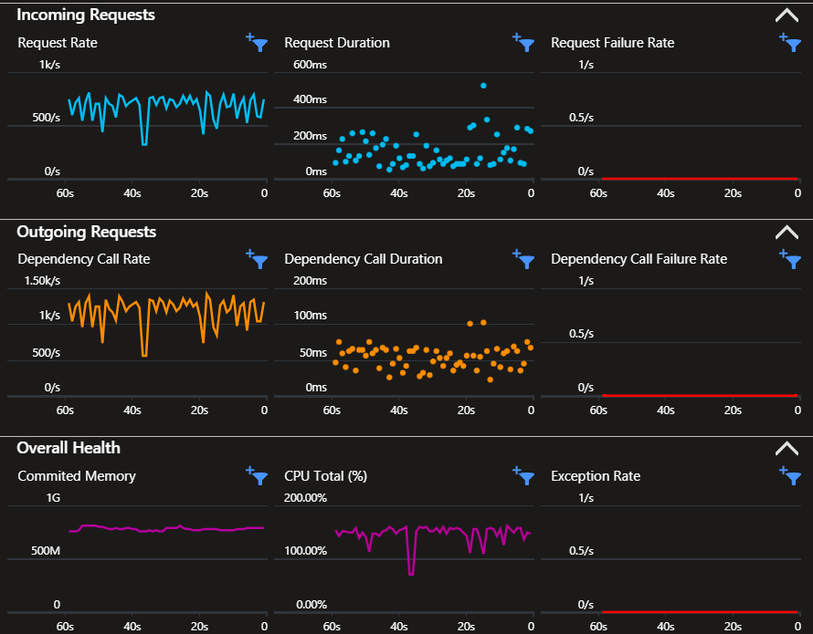

# Django Metrics  

Implementation of a Django REST API sending telemetry to Azure Application Insights from reference [sample][3].

Implement [Cloud_RoleName][2] tags for microservices.



## Setup

### Infrastructure

Create the infrastructure:

```sh
terraform -chdir="azure/terraform" init
terraform -chdir="azure/terraform" apply -auto-approve
```

Get the Application Insights connection string:

```sh
az monitor app-insights component show --app '<appi>' -g '<group>' --query 'connectionString' -o tsv
```

### Application

Create the `.env` file from the template:

```sh
cp samples/sample.env .env
```

Set the `APPLICATIONINSIGHTS_CONNECTION_STRING` environment variable with the Azure value.

## Run

Install the dependencies:

```sh
poetry install
poetry shell
```

Apply the migrations and start the server to start sending telemetry.

```sh
python manage.py migrate
python manage.py runserver --noreload
```

Additional examples [here][4] and [here][5].

## Test

Call the API to test the tracing:

```sh
curl localhost:8000/users/
```

Example KQL query on table `request`:

```sql
requests
| where timestamp >= ago(1h)
```

## Docker

> Code based off my other project [epomatti/benchmarks](https://github.com/epomatti/workload-benchmarks/blob/main/apps/django/Dockerfile).

Make sure the `.env` is configured, and start the application:

```sh
docker compose up --build
```

Test the tracing:

```sh
curl localhost:8000/users/
```


[1]: https://learn.microsoft.com/en-us/azure/azure-monitor/app/separate-resources
[2]: https://learn.microsoft.com/en-us/azure/azure-monitor/app/app-map?tabs=python#set-or-override-cloud-role-name
[3]: https://github.com/Azure/azure-sdk-for-python/blob/main/sdk/monitor/azure-monitor-opentelemetry-exporter/samples/traces/django/sample/manage.py
[4]: https://github.com/open-telemetry/opentelemetry-python-contrib/tree/main/instrumentation/opentelemetry-instrumentation-django
[5]: https://learn.microsoft.com/en-us/python/api/overview/azure/monitor-opentelemetry-readme?view=azure-python
